<div align="center">

# 🛡️ DEEPGUARD: AI THREAT DETECTION
### Next-Gen Anomaly Detection for Cyber-Physical Systems

[](https://www.python.org/)
[](https://www.tensorflow.org/)
[](LICENSE)
[](https://github.com/)

*A Hybrid CNN-LSTM Framework for Real-Time SCADA Security*

[Report Bug](https://github.com/Irfanchillasi/DeepGuard-IDS/issues) • [Request Feature](https://github.com/Irfanchillasi/DeepGuard-IDS/issues)

</div>

---

## 🌌 Overview

**DeepGuard** represents the vanguard of industrial defense. By fusing **1D-Convolutional Neural Networks (CNN)** with **Long Short-Term Memory (LSTM)** units, this framework detects sophisticated "zero-day" cyber-physical attacks that traditional firewalls miss.

It is designed for **Critical Infrastructure (CI)** protection—identifying subtle anomalies in water treatment plants, power grids, and manufacturing pipelines with **<45ms latency**.

## 🧠 The Architecture

DeepGuard processes multivariate time-series data through a high-performance pipeline:

1.  **Spatial Extraction (CNN):** Convolves across sensor inputs to detect local anomalies (e.g., sudden pressure spikes).
2.  **Temporal Reasoning (LSTM):** Analyzes historical sequences to understand process physics (e.g., "If valve A is open, tank B *must* fill").
3.  **Decision Engine:** A dense classification layer that outputs a precise anomaly probability.

```mermaid
graph LR
    A[Raw SCADA Data] --> B(CNN Block: Spatial Features)
    B --> C(LSTM Block: Temporal Memory)
    C --> D{Anomaly Detector}
    D -->|Normal| E[Safe Operation]
    D -->|Attack| F[🚨 ALERT TRIGGERED]
```



## 🚀 Performance Metrics

DeepGuard has been rigorously benchmarked against standard classifiers.

| Metric | Score | Note |
| :--- | :--- | :--- |
| **F1-Score** | **97.3%** | State-of-the-art accuracy |
| **Precision** | **100.0%** | Zero False Positives in testing |
| **Recall** | **94.7%** | Misses <5% of stealthy attacks |
| **Latency** | **45ms** | Real-time edge deployment ready |

## ⚡ Quick Start

### 1. Initialize Environment
```bash
# Clone the repository
git clone https://github.com/Irfanchillasi/DeepGuard-IDS.git
cd DeepGuard-IDS

# Install dependencies
pip install -r requirements.txt
```

### 2. Launch DeepGuard (Training Mode)
```bash
python DeepGuard_Source_Code.py
```
*The system will automatically generate synthetic SCADA data, train the model, and output the diagnostics.*

### 3. Run Real-Time Modbus Simulation 🏭
To demonstrate the system protecting a live plant:

**Terminal 1 (The Power Plant Simulator)**
```bash
# This creates a virtual PLC on localhost:5020
python DeepGuard_PLC_Simulator.py
```

**Terminal 2 (The DeepGuard Security AI)**
```bash
# This connects to the simulator and monitors for attacks
python DeepGuard_RealTime.py
```
*You will see the AI connecting, reading live sensor data, and raising alerts instantly when an attack is injected.*

## 📂 Repository Structure

```
DeepGuard-IDS/
├── 📄 DeepGuard_Source_Code.py  # Core Logic (Model + Simulation)
├── 📄 README.md                 # Documentation
├── 📁 data/                     # Generated Datasets (Auto-created)
├── 📁 models/                   # Saved .h5 Models (Auto-created)
└── 📁 logs/                     # Training Logs & TensorBoard
```

## 🔮 Future Roadmap

- [ ] **Explainable AI (XAI):** Integration of SHAP values to visualize *why* an attack was flagged.
- [ ] **Adversarial Defense:** Hardening the model against gradient-based perturbations.
- [ ] **Federated Learning:** Distributed training across multiple power plants without sharing raw data.

## 📜 Citation

If you use DeepGuard in your research, please cite:

```bibtex
@unpublished{deepguard2026,
  title={DeepGuard: A Hybrid Convolutional-Recurrent Neural Network Framework for Real-Time Anomaly Detection in Critical Cyber-Physical Systems},
  author={Chillasi, Irfan et al.},
  note={Under Review},
  year={2026}
}
```

---
<div align="center">
    
**Secure. Intelligent. Autonomous.**  
*Built for the Industrial Internet of Things (IIoT)*

</div>
